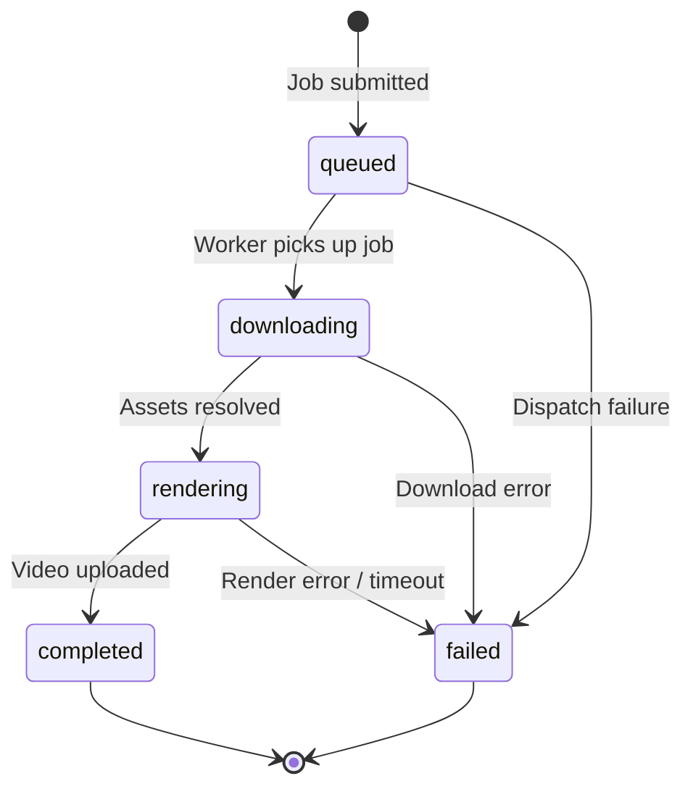

# Jobs API

## GET /v1/jobs/{job_id} — Get Job Status

<span class="custom-badge badge-get">GET</span> `/v1/jobs/{job_id}`

Retrieve the current status, progress, metadata, and artifact links for a specific render job.

### Path Parameters

| Parameter | Type | Description |
|-----------|------|-------------|
| `job_id` | `UUID` | The job identifier returned from `POST /v1/render` |

### Response (200 OK)

```json
{
  "job_id": "550e8400-e29b-41d4-a716-446655440000",
  "status": "completed",
  "progress": 100.0,
  "map_title": "Kano - Prima Stella [Caged]",
  "created_at": "2026-06-08T10:00:00Z",
  "updated_at": "2026-06-08T10:05:30Z",
  "error_message": null,
  "config": {
    "skin": "Default",
    "resolution": "1080p",
    "bg_dim": 0.95,
    "motion_blur": true,
    "storyboard": true,
    "video": false,
    "snaking_in": true,
    "snaking_out": true,
    "hit_error_meter": true,
    "key_overlay": true,
    "replay_stats": {
      "300s": 1245,
      "100s": 12,
      "50s": 0,
      "misses": 1,
      "max_combo": 1847,
      "star_rating": "6.23",
      "pp": 425.8
    }
  },
  "artifacts": {
    "video_url": "/v1/artifacts/videos/550e8400-e29b-41d4-a716-446655440000.mp4",
    "thumbnail_url": "/v1/artifacts/thumbnails/550e8400-e29b-41d4-a716-446655440000.jpg",
    "logs_url": "/v1/artifacts/logs/550e8400-e29b-41d4-a716-446655440000.log"
  }
}
```

### Job Status Values



| Status | Description |
|--------|-------------|
| `queued` | Job accepted, waiting for worker dispatch |
| `downloading` | Worker is downloading replay, beatmap, and skin assets |
| `rendering` | danser-go is actively rendering the video |
| `completed` | Video rendered and uploaded, artifacts available |
| `failed` | Job failed — check `error_message` for details |

### Error Response

| Status | Condition |
|--------|-----------|
| `404` | Job with given ID not found |

---

## GET /v1/jobs — List Jobs

<span class="custom-badge badge-get">GET</span> `/v1/jobs`

Retrieve a paginated list of all render jobs, ordered by creation time (newest first).

### Query Parameters

| Parameter | Type | Default | Range | Description |
|-----------|------|---------|-------|-------------|
| `limit` | `int` | `20` | 1–100 | Maximum number of jobs to return |
| `offset` | `int` | `0` | ≥ 0 | Pagination offset |
| `status` | `string` | *(none)* | — | Filter by job status (`queued`, `rendering`, `completed`, `failed`) |

### Example

```bash
# Get the 10 most recent completed jobs
curl "http://localhost:8727/v1/jobs?limit=10&status=completed"
```

### Response (200 OK)

```json
{
  "total": 142,
  "jobs": [
    {
      "job_id": "...",
      "status": "completed",
      "progress": 100.0,
      "map_title": "Kano - Prima Stella [Caged]",
      "created_at": "2026-06-08T10:00:00Z",
      "updated_at": "2026-06-08T10:05:30Z",
      "error_message": null,
      "config": {},
      "artifacts": {
        "video_url": "/v1/artifacts/videos/....mp4",
        "thumbnail_url": "/v1/artifacts/thumbnails/....jpg",
        "logs_url": "/v1/artifacts/logs/....log"
      }
    }
  ]
}
```

::: tip Error Masking
In production mode (`DEBUG=false`), `error_message` is replaced with a generic message: `"An internal rendering error occurred."` to prevent information leakage.
:::
