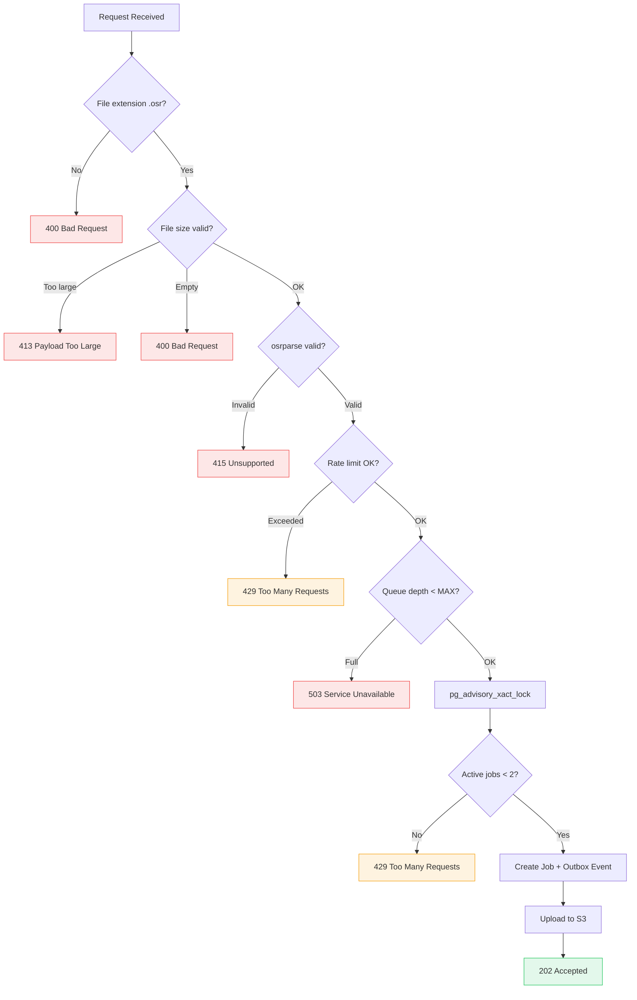

# POST /v1/render — Submit Render

<span class="custom-badge badge-post">POST</span> `/v1/render`

Upload an osu! replay file (`.osr`) with rendering parameters to queue a render job. Returns a `job_id` for tracking.

**Rate Limit:** 5 requests per minute per IP

## Request

**Content-Type:** `multipart/form-data`

### Parameters

| Field | Type | Required | Default | Description |
|-------|------|----------|---------|-------------|
| `replay` | `File` |  | — | The `.osr` replay file |
| `skin` | `string` | — | `Default` | Skin name (alphanumeric, spaces, hyphens, underscores only) |
| `bg_dim` | `float` | — | `0.95` | Background dim (0.0 = none, 1.0 = full). Values > 1.0 are auto-normalized (e.g., `95` → `0.95`) |
| `resolution` | `string` | — | `1080p` | Output resolution: `1080p` or `4k` |
| `motion_blur` | `bool` | — | `true` | Enable motion blur |
| `storyboard` | `bool` | — | `true` | Load beatmap storyboard |
| `video` | `bool` | — | `false` | Load beatmap background video |
| `snaking_in` | `bool` | — | `true` | Slider snaking-in animation |
| `snaking_out` | `bool` | — | `true` | Slider snaking-out animation |
| `hit_error_meter` | `bool` | — | `true` | Show hit error meter overlay |
| `key_overlay` | `bool` | — | `true` | Show key press overlay |

### Example

::: code-group

```bash [curl]
curl -X POST http://localhost:8727/v1/render \
  -F "replay=@my_replay.osr" \
  -F "skin=WhiteCat 1.0" \
  -F "resolution=1080p" \
  -F "bg_dim=0.95" \
  -F "motion_blur=true" \
  -F "storyboard=true" \
  -F "video=false"
```

```python [Python]
import httpx

with open("my_replay.osr", "rb") as f:
    resp = httpx.post(
        "http://localhost:8727/v1/render",
        files={"replay": ("replay.osr", f)},
        data={
            "skin": "WhiteCat 1.0",
            "resolution": "1080p",
            "bg_dim": "0.95",
        },
    )
print(resp.json())
```

:::

## Response

**Status:** `202 Accepted`

```json
{
  "job_id": "550e8400-e29b-41d4-a716-446655440000",
  "status": "queued",
  "links": {
    "status": "/v1/jobs/550e8400-e29b-41d4-a716-446655440000"
  }
}
```

## Validation Rules

The endpoint performs extensive validation before accepting a job:

### File Validation
- **Extension**: Must end in `.osr`
- **Size**: Must not exceed `MAX_REPLAY_SIZE_MB` (default 50 MB)
- **Not empty**: File size must be > 0
- **Structure**: Parsed with `osrparse` to verify replay integrity
- **Game mode**: Only osu!standard replays (mode 0) are supported

### Parameter Validation
- **Skin name**: Must match regex `^[a-zA-Z0-9_ -]+$`
- **Resolution**: Must be `1080p` or `4k`
- **bg_dim**: Must be between 0.0 and 1.0 (auto-normalized if > 1.0)

### Capacity Checks
- **Global queue**: Rejects if `MAX_QUEUED` (100) jobs are already queued
- **Global rendering**: Rejects if `MAX_RENDERING` (20) jobs are rendering
- **Per-IP limit**: Maximum 2 active jobs per IP (enforced via `pg_advisory_xact_lock`)

## Error Responses

| Status | Condition | Detail |
|--------|-----------|--------|
| `400` | Missing/wrong file extension | `File must be an osu! replay (.osr) file.` |
| `400` | Empty file | `Uploaded replay file is empty.` |
| `413` | File too large | `Replay file exceeds maximum size of 50MB.` |
| `415` | Invalid replay structure | `Invalid replay file. The structure is corrupted or unsupported.` |
| `422` | Invalid skin name or parameters | Pydantic validation error |
| `429` | Rate limit exceeded | `Rate limit exceeded: 5 per 1 minute` |
| `429` | Per-IP concurrent limit | `You already have 2 active render jobs.` |
| `503` | Queue full | `The render queue is currently full. Please try again later.` |
| `503` | At capacity | `The render infrastructure is at maximum capacity.` |

## Admission Control Flow


