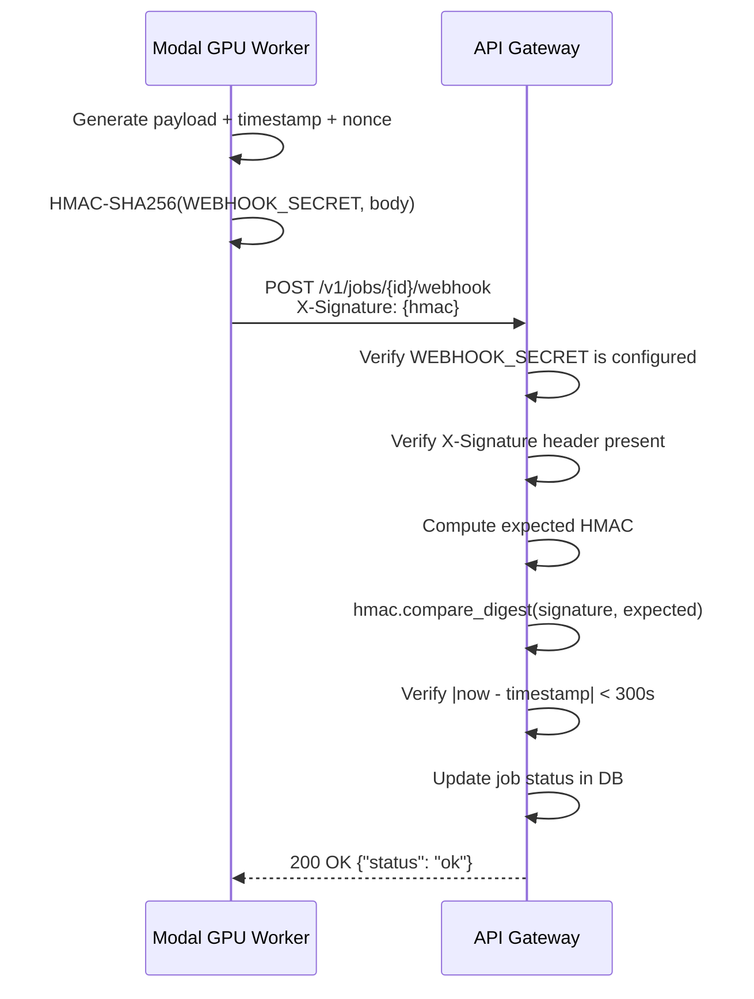

# Webhook API

<span class="custom-badge badge-post">POST</span> `/v1/jobs/{job_id}/webhook`

Internal endpoint used by Modal GPU workers to push render completion results back to the API. Not intended for external use.

## Authentication

Webhooks are authenticated using **HMAC-SHA256** signatures with **replay protection**:

1. The request body is signed with the shared `WEBHOOK_SECRET`
2. The signature is sent in the `X-Signature` header
3. A timestamp and nonce prevent replay attacks (5-minute window)

## Request

**Content-Type:** `application/json`

```json
{
  "success": true,
  "video_key": "videos/550e8400-....mp4",
  "thumb_key": "thumbnails/550e8400-....jpg",
  "log_key": "logs/550e8400-....log",
  "error": "",
  "pp": 425.8,
  "timestamp": 1717848000,
  "nonce": "a1b2c3d4-e5f6-7890-abcd-ef1234567890"
}
```

### Fields

| Field | Type | Description |
|-------|------|-------------|
| `success` | `bool` | Whether the render succeeded |
| `video_key` | `string` | S3 key of the rendered video |
| `thumb_key` | `string` | S3 key of the thumbnail |
| `log_key` | `string` | S3 key of the render log |
| `error` | `string` | Error message if `success` is false |
| `pp` | `float` | PP value parsed from danser output |
| `timestamp` | `int` | Unix timestamp (replay protection) |
| `nonce` | `string` | Unique nonce (replay protection) |

## Verification Flow



## Error Responses

| Status | Condition |
|--------|-----------|
| `401` | Missing or invalid `X-Signature` header |
| `400` | Payload expired (timestamp > 5 min old) |
| `404` | Job not found |
| `422` | Invalid JSON body |
| `500` | `WEBHOOK_SECRET` not configured on server |
