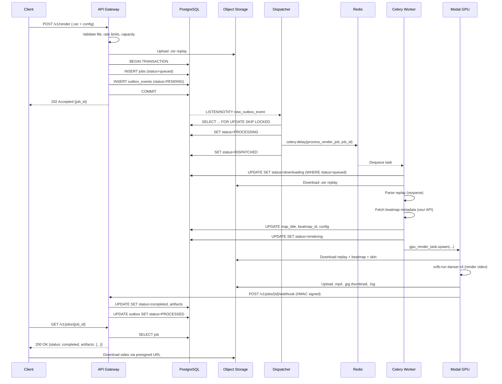
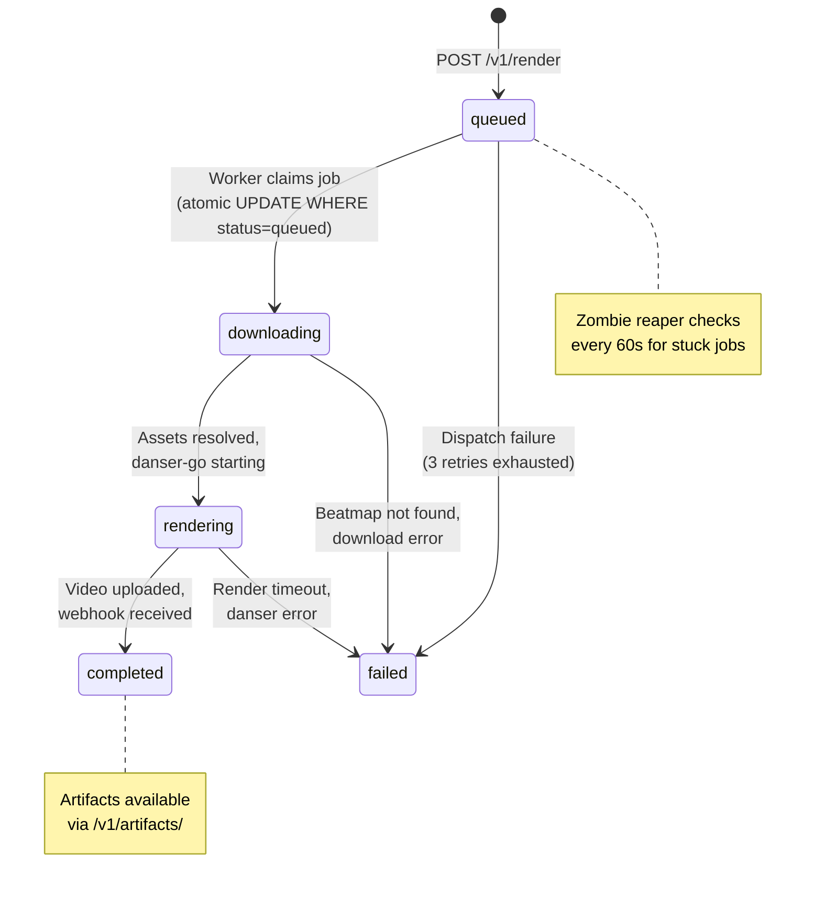

# Data Flow & Job Lifecycle

This page details the complete lifecycle of a render job from submission to video delivery.

## End-to-End Sequence



## Job State Machine



## Atomic State Transitions

Job status transitions use **atomic SQL updates** to prevent race conditions:

```python
# Only one worker can claim a job
update_stmt = (
    update(Job)
    .where(Job.id == job_id, Job.status == JobStatus.QUEUED)
    .values(status=JobStatus.DOWNLOADING)
)
result = await db.execute(update_stmt)
if result.rowcount == 0:
    # Another worker already claimed this job
    return "aborted"
```

This ensures that even if duplicate Celery tasks are dispatched for the same job, only one worker will successfully claim it.

## Data Stored Per Job

| Phase | Data Created | Storage |
|-------|-------------|---------|
| **Submission** | Job record, outbox event, `.osr` replay | PostgreSQL, S3 |
| **Downloading** | Beatmap metadata, map title, replay stats | PostgreSQL |
| **Rendering** | Live render logs, progress updates | S3 (periodic), PostgreSQL |
| **Completion** | `.mp4` video, `.jpg` thumbnail, final log | S3 |
| **Failure** | Error message, partial logs | PostgreSQL, S3 |

## Zombie Job Recovery

The `reap_zombie_jobs` Celery Beat task runs every 60 seconds:

1. **Stuck rendering/downloading** (> 15 min): Checks Modal for results, marks as failed if unrecoverable
2. **Stuck queued** (> 5 min): Increments retry counter
3. **Retry exhausted** (> 3 retries): Marks as permanently failed
