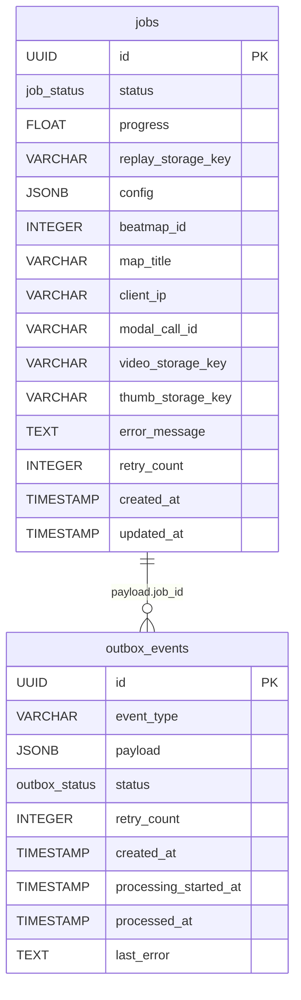

# Database Schema

OsuRender API uses PostgreSQL 16 with async SQLAlchemy ORM. Migrations are managed by Alembic.

## Entity-Relationship Diagram



## Jobs Table

The `jobs` table is the primary entity storing render job state.

### Columns

| Column | Type | Nullable | Default | Description |
|--------|------|----------|---------|-------------|
| `id` | `UUID` |  | `uuid4()` | Primary key |
| `status` | `job_status` |  | `queued` | Current job state |
| `progress` | `FLOAT` |  | `0.0` | Render progress percentage |
| `replay_storage_key` | `VARCHAR(512)` |  | — | S3 key of uploaded replay |
| `config` | `JSONB` |  | `{}` | Rendering configuration + replay stats |
| `beatmap_id` | `INTEGER` |  | — | osu! beatmap ID (resolved during download) |
| `map_title` | `VARCHAR(512)` |  | — | "Artist - Title" (resolved during download) |
| `client_ip` | `VARCHAR(45)` |  | — | Submitter's IP (for rate limiting) |
| `modal_call_id` | `VARCHAR(100)` |  | — | Modal function call ID (for polling fallback) |
| `video_storage_key` | `VARCHAR(512)` |  | — | S3 key of rendered video |
| `thumb_storage_key` | `VARCHAR(512)` |  | — | S3 key of thumbnail |
| `error_message` | `TEXT` |  | — | Error details on failure |
| `retry_count` | `INTEGER` |  | `0` | Number of dispatch retries |
| `created_at` | `TIMESTAMP(tz)` |  | `now()` | Job creation time |
| `updated_at` | `TIMESTAMP(tz)` |  | `now()` | Last modification time (auto-updated) |

### Indexes

| Name | Columns | Purpose |
|------|---------|---------|
| `idx_jobs_status` | `status` | Fast filtering by status |
| `idx_jobs_created_at` | `created_at` | Ordering and pagination |
| *(implicit)* | `client_ip` | Per-IP job counting |

### Enum: `job_status`

```sql
CREATE TYPE job_status AS ENUM (
    'queued', 'downloading', 'rendering', 'completed', 'failed'
);
```

## Outbox Events Table

The `outbox_events` table implements the transactional outbox pattern.

### Columns

| Column | Type | Nullable | Default | Description |
|--------|------|----------|---------|-------------|
| `id` | `UUID` |  | `uuid4()` | Primary key |
| `event_type` | `VARCHAR(100)` |  | — | Event name (e.g., `render_job_created`) |
| `payload` | `JSONB` |  | — | Event data (contains `job_id`) |
| `status` | `outbox_status` |  | `PENDING` | Current event state |
| `retry_count` | `INTEGER` |  | `0` | Dispatch retry count |
| `created_at` | `TIMESTAMP(tz)` |  | `now()` | Event creation time |
| `processing_started_at` | `TIMESTAMP(tz)` |  | — | When dispatcher claimed the event |
| `processed_at` | `TIMESTAMP(tz)` |  | — | When the event was fully processed |
| `last_error` | `TEXT` |  | — | Error from last dispatch attempt |

### Indexes

| Name | Columns | Purpose |
|------|---------|---------|
| `idx_outbox_status_created` | `status`, `created_at` | Ordered drain queries |
| `idx_outbox_processing` | `status`, `processing_started_at` | Stuck event sweeper |

### Enum: `outbox_status`

```sql
CREATE TYPE outbox_status AS ENUM (
    'PENDING', 'PROCESSING', 'DISPATCHED', 'PROCESSED', 'FAILED'
);
```

## Migrations

Database migrations are managed by [Alembic](https://alembic.sqlalchemy.org/):

```bash
# Create a new migration
alembic revision --autogenerate -m "description"

# Apply all migrations
alembic upgrade head

# Rollback one migration
alembic downgrade -1
```

The `alembic/env.py` reads `DATABASE_URL_SYNC` from the application settings for connection.

## Connection Management

```python
# Async engine with connection pooling
engine = create_async_engine(
    settings.database_url,
    pool_size=5,
    max_overflow=10,
    pool_pre_ping=True,   # Detect stale connections
)

# Session factory with expire_on_commit=False
# (allows reading attributes after commit without re-query)
session_factory = async_sessionmaker(
    bind=engine,
    class_=AsyncSession,
    expire_on_commit=False,
)
```
