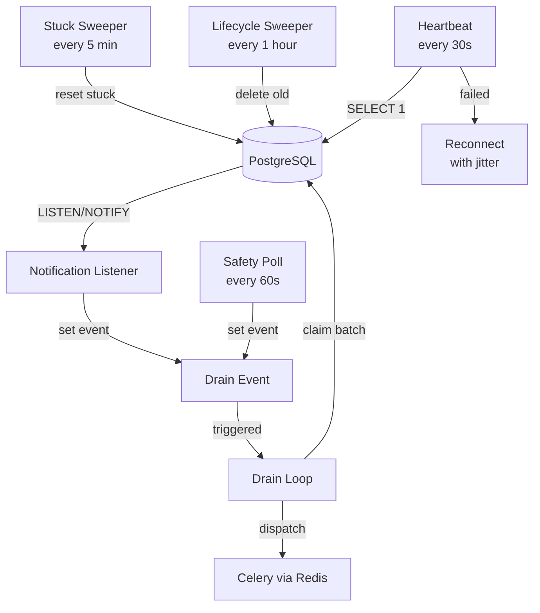

# Dispatcher Deep-Dive

The `OutboxDispatcher` is the bridge between the PostgreSQL outbox and Celery workers. It runs as a dedicated long-lived process (`WORKER_TYPE=dispatcher`).

## Internal Architecture



## Connection Management

The Dispatcher uses **raw asyncpg** (not SQLAlchemy) for two critical reasons:

1. **LISTEN/NOTIFY** requires a persistent connection — SQLAlchemy's session-based model doesn't support it well
2. **Performance** — direct asyncpg avoids ORM overhead for high-throughput draining

```python
# Two separate connections:
self.conn = await asyncpg.connect(...)      # Dedicated listener connection
await self.conn.add_listener("new_outbox_event", self.handle_notification)

self.pool = await asyncpg.create_pool(...)  # Pool for drain operations
```

## Drain Loop Mechanics

The drain loop is event-driven, not polling-based:

```python
async def drain_loop(self):
    while True:
        await self._drain_event.wait()   # Block until notification or poll
        self._drain_event.clear()
        
        while True:
            processed = await self.drain_outbox()
            if not processed:            # No more pending events
                break                    # Wait for next trigger
```

Each drain operation claims up to **100 events** per batch using `FOR UPDATE SKIP LOCKED`, processes them sequentially, and dispatches each to Celery.

## Retry Logic

When dispatch fails (e.g., Redis is down):

```
retry_count < 3  →  Reset to PENDING, increment retry_count
retry_count >= 3  →  Mark as FAILED (Dead Letter Queue)
```

## Background Tasks

| Task | Interval | Purpose |
|------|----------|---------|
| **Safety Poll** | 60s | Triggers drain in case LISTEN/NOTIFY was missed |
| **Stuck Sweeper** | 5 min | Resets `PROCESSING` events older than 5 min; resets `DISPATCHED` events older than 60 min |
| **Lifecycle Sweeper** | 1 hour | Deletes `PROCESSED` events older than 7 days |
| **Heartbeat** | 30s | `SELECT 1` on listener connection to detect disconnection |

## Reconnection Strategy

When the PostgreSQL connection drops:

1. Cancel all background tasks
2. Close the connection pool
3. Record reconnection reason in Prometheus metrics
4. Wait with **exponential backoff + jitter** (3–10 seconds)
5. Reconnect and restart all tasks
6. Immediately trigger a drain (catch up on any missed events)

```python
jitter = random.uniform(3, 10)
logger.info(f"Reconnecting dispatcher in {jitter:.2f} seconds...")
await asyncio.sleep(jitter)
```

## Prometheus Metrics

| Metric | Type | Description |
|--------|------|-------------|
| `outbox_dispatch_total` | Counter | Events successfully dispatched |
| `dispatch_latency_seconds` | Histogram | Time from event creation to dispatch |
| `listener_reconnects_total` | Counter | Reconnection count by reason |
| `stuck_processing_events_total` | Counter | Events rescued by sweeper |
