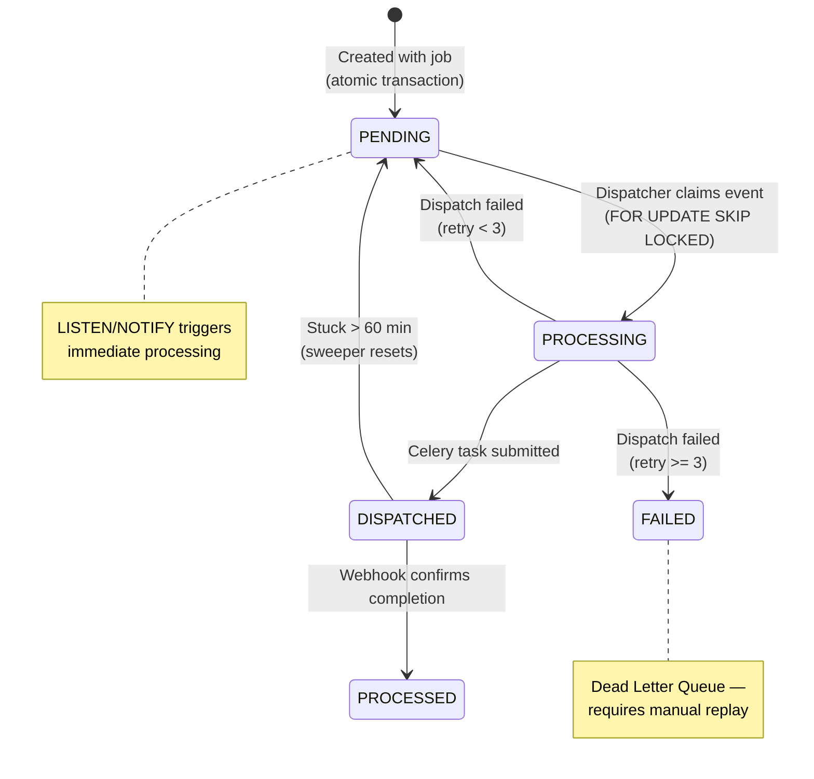

# Transactional Outbox Pattern

The Transactional Outbox is the core reliability pattern in OsuRender API. It solves the **dual-write problem** that plagues most queue-based architectures.

## The Problem

When a client submits a render job, two things must happen:
1. **Insert a job record** into PostgreSQL
2. **Enqueue a task** to Redis/Celery

If these are done separately, failure between the two operations creates inconsistency:

| Scenario | DB Insert | Queue Publish | Result |
|----------|-----------|---------------|--------|
|  Happy path |  |  | Job created and dispatched |
|  Queue failure |  |  | **Ghost job** — exists in DB but never processed |
|  DB failure |  |  | **Phantom task** — worker processes non-existent job |

## The Solution

Both the `Job` and the `OutboxEvent` are inserted in a **single PostgreSQL transaction**:

```python
# In src/api/routes/render.py — single atomic transaction
job = Job(id=job_id, status=JobStatus.QUEUED, ...)
db.add(job)

outbox_event = OutboxEvent(
    event_type="render_job_created",
    payload={"job_id": str(job.id)},
    status=OutboxStatus.PENDING,
)
db.add(outbox_event)
await db.commit()  # Both or neither
```

A separate **Dispatcher** process reads pending outbox events and publishes them to Celery.

## Outbox Event State Machine



## How the Dispatcher Works

The `OutboxDispatcher` (in `src/workers/dispatcher.py`) uses three mechanisms to ensure reliable delivery:

### 1. PostgreSQL LISTEN/NOTIFY (Real-time)
When an outbox event is inserted, a PostgreSQL trigger fires `NOTIFY new_outbox_event`. The Dispatcher receives this instantly and starts draining.

### 2. Safety Poll (Fallback)
Every **60 seconds**, the Dispatcher polls for pending events regardless of notifications. This handles the case where `LISTEN/NOTIFY` is temporarily unavailable.

### 3. Stuck Event Sweeper (Recovery)
Every **5 minutes**, the sweeper resets events stuck in `PROCESSING` state for more than 5 minutes (or `DISPATCHED` for more than 60 minutes).

## Concurrent Dispatcher Scaling

Multiple Dispatcher instances can run safely using PostgreSQL's `FOR UPDATE SKIP LOCKED`:

```sql
WITH claimed AS (
    SELECT id FROM outbox_events 
    WHERE status = 'PENDING' 
    ORDER BY created_at 
    LIMIT 100 
    FOR UPDATE SKIP LOCKED    -- ← No duplicate claims!
)
UPDATE outbox_events 
SET status = 'PROCESSING', processing_started_at = NOW() 
WHERE id IN (SELECT id FROM claimed) 
RETURNING *;
```

This guarantees that each event is claimed by exactly one Dispatcher instance, enabling horizontal scaling without coordination.

## Proven Guarantees

These properties are verified by the chaos test suite:

| Test | Guarantee |
|------|-----------|
| **A1** | Lost notifications don't lose jobs (safety poll recovers) |
| **A2** | Dispatcher crash mid-drain doesn't lose jobs (sweeper recovers) |
| **A3** | Notification storms are batched efficiently |
| **A4** | Stuck events are reset after timeout |
| **A5** | `SKIP LOCKED` prevents duplicate claims across 3 concurrent dispatchers |
