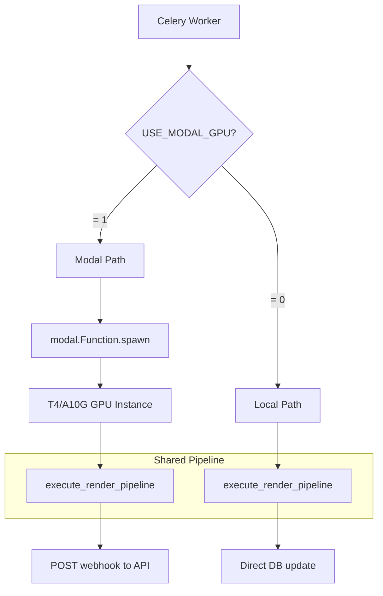
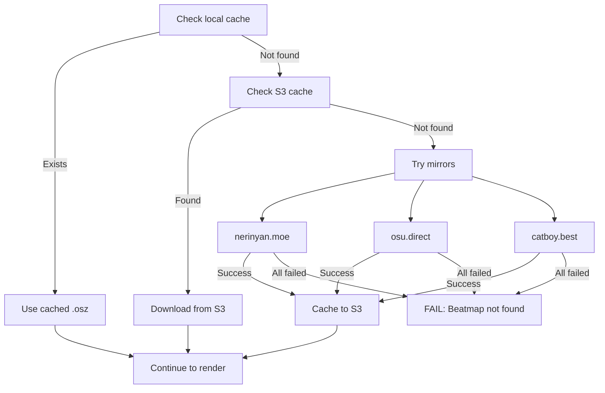

# Render Pipeline

The render pipeline handles the full process of transforming an `.osr` replay file into a rendered `.mp4` video. It supports two execution paths: **Modal GPU** (production) and **Local danser** (development).

## Execution Paths



## Pipeline Stages

Both paths share the same core pipeline (`src/core/render_pipeline.py`):

### 1. Directory Setup
Creates the osu! directory structure and symlinks required by danser-go:
```
~/.osu/Songs → /mnt/osu_data/Songs (or /tmp/osu_data/Songs)
~/.osu/Skins → /mnt/osu_data/Skins
```

### 2. Replay Download
Downloads the `.osr` file from S3/R2 to a temporary directory.

### 3. Beatmap Resolution



Beatmap mirror fallback order:
1. `https://api.nerinyan.moe/d/{set_id}`
2. `https://osu.direct/api/d/{set_id}`
3. `https://catboy.best/d/{set_id}`

### 4. Skin Download
If a non-default skin is specified, it's downloaded from S3 and extracted with **zip bomb protection** (max 1 GB uncompressed, path traversal checks).

### 5. Danser Rendering
The core rendering uses `xvfb-run` (virtual framebuffer) with danser-go:

```bash
xvfb-run -a -s "-screen 0 1920x1080x24 +extension GLX +render -noreset" \
  danser-cli \
  -replay=replay.osr \
  -skin=Default \
  -sPatch=settings.json \
  -out=render_jobid \
  -record
```

### 6. Settings Patch
danser-go is configured via a JSON settings patch generated from the job config:

```json
{
  "Graphics": { "Width": 1920, "Height": 1080 },
  "Gameplay": {
    "HitErrorMeter": { "Show": true },
    "KeyOverlay": { "Show": true }
  },
  "Skin": {
    "CurrentSkin": "Default",
    "UseBeatmapColors": false,
    "Cursor": { "UseSkinCursor": true, "Scale": 0.6 }
  },
  "Playfield": {
    "Background": {
      "Dim": { "Normal": 0.95 },
      "LoadStoryboards": true,
      "LoadVideos": false
    }
  },
  "Recording": {
    "MotionBlur": { "Enabled": true },
    "Encoder": "libx264"
  }
}
```

### 7. Log Streaming
During the render, logs are uploaded to S3 **every 3 seconds** so clients can monitor progress in real-time via `/v1/artifacts/logs/{job_id}.log`.

### 8. Post-Processing
- **Thumbnail generation**: `ffmpeg` extracts a frame at 00:00:15
- **PP parsing**: Regex extraction from danser's output table
- **Video upload**: Final `.mp4` uploaded to S3

### 9. Artifact Upload
All artifacts are uploaded with appropriate content types:

| Artifact | S3 Key | Content-Type |
|----------|--------|-------------|
| Video | `videos/{job_id}.mp4` | `video/mp4` |
| Thumbnail | `thumbnails/{job_id}.jpg` | `image/jpeg` |
| Logs | `logs/{job_id}.log` | `text/plain` |

## Worker Idempotency

The Celery worker uses an **atomic status transition** to prevent duplicate execution:

```python
update_stmt = (
    update(Job)
    .where(Job.id == job_id, Job.status == JobStatus.QUEUED)
    .values(status=JobStatus.DOWNLOADING)
)
res = await db.execute(update_stmt)
if res.rowcount == 0:
    return "aborted"  # Another worker already claimed this
```

## Timeouts

| Timeout | Duration | Action |
|---------|----------|--------|
| Danser render | 600s (10 min) | Process killed, job marked failed |
| Modal function | 660s (11 min) | Container terminated |
| Celery task | 660s hard, 600s soft | Task revoked |
| Thumbnail ffmpeg | 30s | Process killed |
