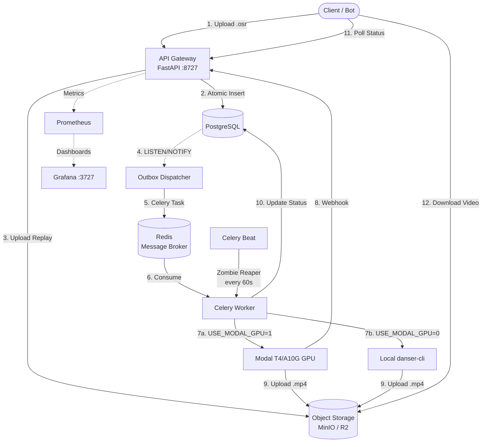

# System Overview

OsuRender API is architected as a distributed, event-driven system with clear separation between the API tier, job orchestration, and compute-intensive rendering.

## High-Level Architecture

## Component Summary

| Component | Technology | Role | Stateless? |
|-----------|-----------|------|------------|
| **API Gateway** | FastAPI + Uvicorn | HTTP entry point, validation, job creation |  |
| **Database** | PostgreSQL 16 | Source of truth for jobs, outbox events | — |
| **Message Broker** | Redis 7 | Celery task queue, rate limiter backend | — |
| **Object Storage** | MinIO (dev) / R2 (prod) | Binary artifacts (replays, videos, skins, logs) | — |
| **Dispatcher** | Custom Python async | PostgreSQL outbox → Celery bridge |  |
| **Celery Worker** | Celery 5 | Job orchestration, asset resolution |  |
| **Celery Beat** | Celery Beat | Scheduled zombie job reaper (60s interval) |  |
| **GPU Compute** | Modal / Local danser | Video rendering via danser-go |  |
| **Monitoring** | Prometheus + Grafana | Metrics collection and dashboards | — |

## Design Principles

### 1. Guaranteed Job Delivery
The **Transactional Outbox pattern** ensures that job creation and dispatch are atomic. A job is never created without a corresponding dispatch event in the same database transaction.

### 2. Stateless Everything
All processing components (API, Dispatcher, Workers) are stateless and can be horizontally scaled. State lives exclusively in PostgreSQL and Redis.

### 3. Defense-in-Depth
Security is implemented at every layer — from Cloudflare edge protection, through API-level validation and rate limiting, to subprocess environment sandboxing.

### 4. Fail-Safe Defaults
- Stuck jobs are automatically reaped after 15 minutes
- Failed dispatch events are retried up to 3 times before going to the Dead Letter Queue
- The Dispatcher reconnects with exponential backoff + jitter

### 5. Observability by Default
Every component emits Prometheus metrics. Structured JSON logging with correlation IDs (`request_id`, `job_id`, `event_id`, `worker_id`) enables end-to-end tracing.
