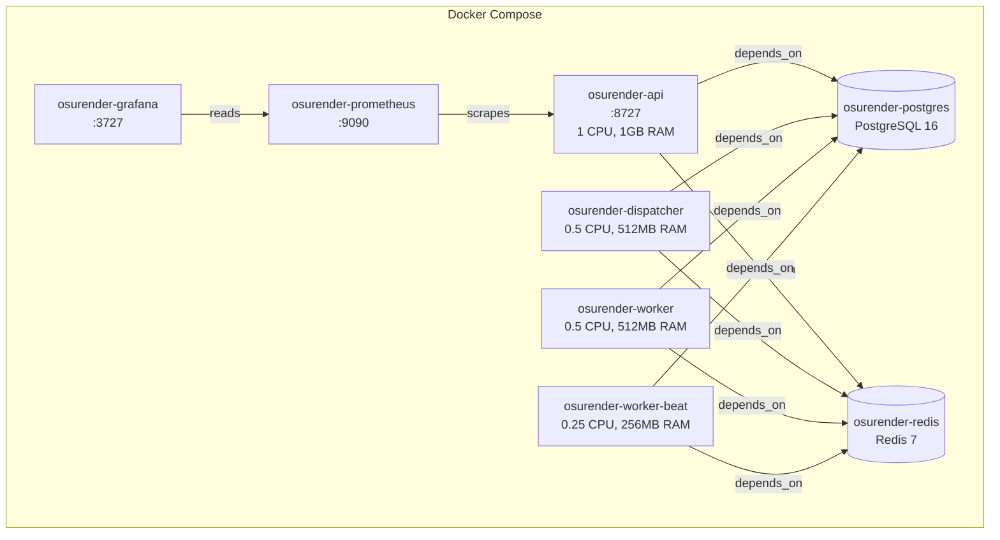

# Docker Compose Deployment

The full OsuRender stack is containerized and deployable via a single `docker-compose up` command.

## Service Topology



## Quick Start

```bash
# Clone and configure
git clone https://github.com/Azaken1248/OsuRenderApi.git
cd OsuRenderApi
cp .env.example .env
# Edit .env with your credentials

# Start everything
docker-compose up -d --build

# Watch logs
docker-compose logs -f api dispatcher worker
```

## Services

### Application Services

| Service | Container | WORKER_TYPE | Port | Resources |
|---------|-----------|-------------|------|-----------|
| API Gateway | `osurender-api` | `api` | 8727 | 1 CPU, 1 GB RAM |
| Dispatcher | `osurender-dispatcher` | `dispatcher` | — | 0.5 CPU, 512 MB RAM |
| Celery Worker | `osurender-worker` | `celery` | — | 0.5 CPU, 512 MB RAM |
| Celery Beat | `osurender-worker-beat` | `beat` | — | 0.25 CPU, 256 MB RAM |

### Infrastructure Services

| Service | Container | Port | Data Volume |
|---------|-----------|------|-------------|
| PostgreSQL 16 | `osurender-postgres` | 5432 | `pg_data` |
| Redis 7 | `osurender-redis` | 6379 | `redis_data` |
| Prometheus | `osurender-prometheus` | 9090 | `prometheus_data` |
| Grafana | `osurender-grafana` | 3727 | `grafana_data` |

## Health Checks

PostgreSQL and Redis have built-in health checks. Application services wait for healthy infrastructure before starting:

```yaml
postgres:
  healthcheck:
    test: ["CMD-SHELL", "pg_isready -U $${POSTGRES_USER}"]
    interval: 5s
    timeout: 5s
    retries: 5
```

## Entrypoint Routing

All application containers share the same Docker image. The `WORKER_TYPE` environment variable determines which process starts via `scripts/start.sh`:

```bash
case "$WORKER_TYPE" in
  api)        uvicorn src.api.app:create_app --factory ;;
  dispatcher) python -m src.workers.dispatcher ;;
  celery)     celery -A src.core.celery_app.celery_app worker ;;
  beat)       celery -A src.core.celery_app.celery_app beat ;;
esac
```

## Scaling Workers

To run multiple Celery workers:

```bash
docker-compose up -d --scale worker=3
```

## Volumes

| Volume | Persistence | Contents |
|--------|-------------|----------|
| `pg_data` | Persistent | PostgreSQL database files |
| `redis_data` | Persistent | Redis RDB snapshots |
| `prometheus_data` | Persistent | Prometheus TSDB |
| `grafana_data` | Persistent | Grafana dashboards and config |

## Useful Commands

```bash
# View all service statuses
docker-compose ps

# View logs for a specific service
docker-compose logs -f dispatcher

# Restart a single service
docker-compose restart worker

# Run database migrations manually
docker-compose exec api alembic upgrade head

# Access PostgreSQL directly
docker-compose exec postgres psql -U osurender

# Flush Redis
docker-compose exec redis redis-cli FLUSHALL
```
