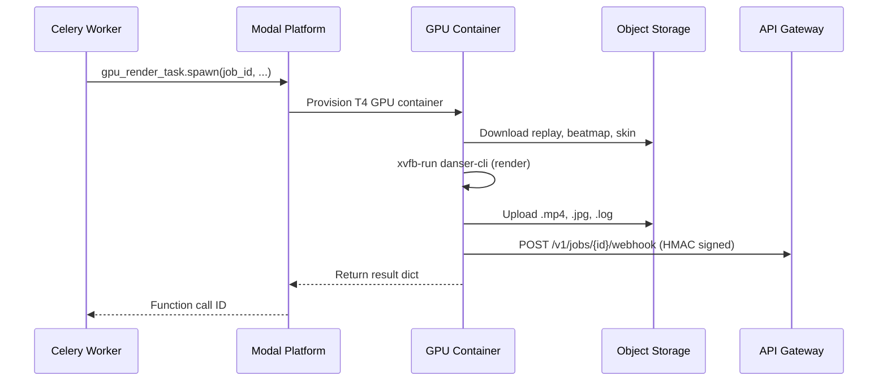

# Modal GPU Workers

OsuRender uses [Modal](https://modal.com) for serverless GPU-accelerated video rendering. When `USE_MODAL_GPU=1`, render jobs are offloaded to Modal's T4/A10G GPU instances.

## How It Works



## Modal App Structure

The Modal app is defined in `src/modal_deploy.py`:

```python
app = modal.App("osurender-gpu-worker")

# Persistent volume for beatmap/skin caching
assets_vol = modal.Volume.from_name("osu-assets", create_if_missing=True)

@app.function(
    image=image,           # Debian + danser-go + ffmpeg + xvfb
    gpu="T4",              # NVIDIA T4 GPU
    volumes={"/mnt/osu_data": assets_vol},
    timeout=660,           # 11-minute hard timeout
    secrets=[modal.Secret.from_name("osurender-secrets")],
)
async def gpu_render_task(...) -> dict:
    ...
```

## Container Image

The Modal container image is built with:

- **Base**: `debian_slim()`
- **System packages**: `ffmpeg`, `xvfb`, OpenGL libraries, `wget`, `unzip`
- **Python packages**: `boto3`, `aioboto3`, `httpx`
- **danser-go**: v0.11.0 installed to `/usr/local/bin/danser/danser-cli`
- **Source code**: `src/` directory mounted at `/root/src`

## Asset Caching

The `osu-assets` Modal Volume persists across function invocations:

```
/mnt/osu_data/
├── Songs/     # Cached .osz beatmap files
└── Skins/     # Extracted skin directories
```

When a beatmap or skin is downloaded, `assets_vol.commit()` is called to persist it. Subsequent renders of the same beatmap skip the download entirely.

## Secrets Configuration

```bash
modal secret create osurender-secrets \
  S3_ENDPOINT="https://your-account.r2.cloudflarestorage.com" \
  S3_ACCESS_KEY="your_access_key" \
  S3_SECRET_KEY="your_secret_key" \
  WEBHOOK_SECRET="your_webhook_secret"
```

## Webhook Callback

After rendering, the GPU worker sends results back via an HMAC-signed webhook:

1. Constructs payload with `video_key`, `thumb_key`, `log_key`, `pp`, `timestamp`, `nonce`
2. Signs the body with `HMAC-SHA256(WEBHOOK_SECRET, body)`
3. POSTs to `{API_BASE_URL}/v1/jobs/{job_id}/webhook`

## Deployment

```bash
# Deploy (creates or updates the Modal app)
modal deploy src.modal_deploy

# Test locally
modal run src.modal_deploy

# View logs
modal app logs osurender-gpu-worker
```

## Fallback: Local Rendering

Set `USE_MODAL_GPU=0` to render locally using the same `execute_render_pipeline()` function. This requires:

- danser-go installed locally (`DANSER_BIN` env var)
- `xvfb` and `ffmpeg` available
- Sufficient GPU/CPU resources

## Cost

Modal charges per-second of GPU usage:
- **T4**: ~$0.000164/sec (~$0.59/hour)
- Typical 1080p render: 2-4 minutes → ~$0.02-0.04 per render
- Free credits: $30/month → ~500-1500 renders/month
