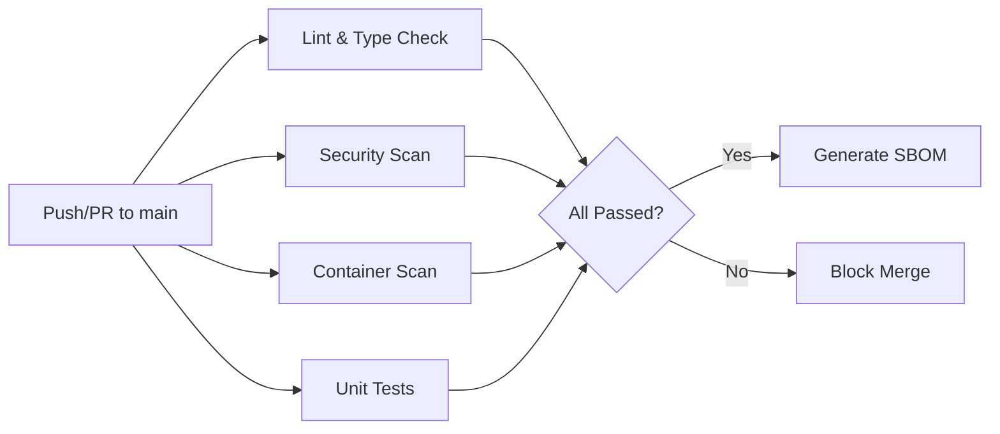

# CI/CD Pipeline

OsuRender uses GitHub Actions for continuous integration and continuous deployment.

## Pipeline Architecture



## Workflows

The CI pipeline is defined in `.github/workflows/ci.yml`.

### 1. Lint & Type Check
- **Black**: Ensures consistent code formatting
- **Ruff**: Extremely fast Python linter checking for anti-patterns
- **Pyright**: Strict static type checking

### 2. Security Scanning
- **Trivy (FS)**: Scans the repository filesystem for vulnerable dependencies and exposed secrets
- **pip-audit**: Audits Python dependencies against the PyPA advisory database

### 3. Container Scanning
- **Docker Build**: Builds the `osurender-api:ci` image
- **Trivy (Image)**: Scans the built container image for OS-level and application vulnerabilities

### 4. Testing
- Runs the Pytest suite with `MOCK_DANSER=1`
- Generates a coverage report
- Requires mock PostgreSQL and Redis services (provided by GitHub Actions environment variables)

### 5. SBOM Generation
- Generates a CycloneDX Software Bill of Materials (`sbom.json`)
- Only runs on pushes to the `main` branch (not PRs)
- Uploads the SBOM as a workflow artifact

## Dependency Management

Dependencies are managed using `pip-tools` to ensure deterministic builds.

- `requirements.in`: High-level dependencies
- `requirements.lock`: Pinned versions with hashes

To update dependencies:

```bash
pip install pip-tools
pip-compile requirements.in --generate-hashes -o requirements.lock
```

### Dependabot
Automated dependency updates are configured in `.github/dependabot.yml`:
- Weekly updates for pip dependencies
- Weekly updates for Docker base images
- Weekly updates for GitHub Actions
