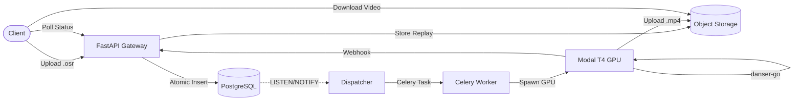

# Introduction

**OsuRender API** is a production-grade, distributed service that transforms [osu!](https://osu.ppy.sh) replay files (`.osr`) into high-quality rendered videos using [danser-go](https://github.com/Wieku/danser-go).

## What Does It Do?

You upload an osu! replay file, configure rendering options (skin, resolution, background dim, etc.), and OsuRender handles everything else:

1. **Validates** the replay file structure and rendering parameters
2. **Queues** the job via a transactional outbox pattern for guaranteed delivery
3. **Downloads** the required beatmap from mirror servers
4. **Renders** the replay using danser-go on GPU-accelerated infrastructure
5. **Delivers** the finished `.mp4` video, thumbnail, and render logs

## Architecture at a Glance

## Key Design Decisions

| Decision | Choice | Why |
|----------|--------|-----|
| **Job Dispatch** | Transactional Outbox | Eliminates dual-write problem — no lost jobs |
| **Queue Backend** | PostgreSQL `SKIP LOCKED` | No extra infrastructure, transactional consistency |
| **GPU Compute** | Modal Serverless | Zero management, pay-per-second, auto-scaling |
| **Object Storage** | Cloudflare R2 / MinIO | Zero egress fees, S3-compatible API |
| **API Framework** | FastAPI | Async-native, automatic OpenAPI docs, Pydantic validation |

## Who Is This For?

- **Bot developers** integrating osu! replay rendering into Discord bots
- **osu! community tools** that need automated video generation
- **Self-hosters** who want to run their own rendering infrastructure
- **Engineers** interested in production-grade Python distributed systems

## Next Steps

[**Quick Start →**](/src/getting-started/quick-start)
Get rendering in under 5 minutes.

[**API Reference →**](/src/api-reference/overview)
Full endpoint documentation with examples.

[**Architecture →**](/src/architecture/system-overview)
Deep-dive into the system design.

[**Deployment →**](/src/deployment/docker-compose)
Deploy your own instance.

