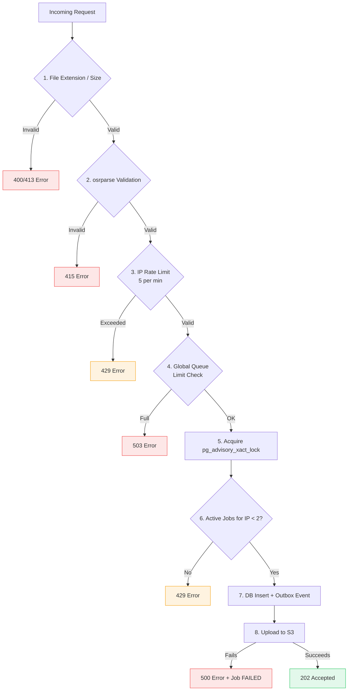

# Security Model

OsuRender API employs a defense-in-depth security model to protect the infrastructure from abuse and malicious payloads.

## Admission Control Hierarchy

Every render request passes through a strict sequence of checks before it is accepted into the system:

## Layers of Defense

### 1. Perimeter (Cloudflare)
- The API should only accept traffic from Cloudflare IP ranges
- Cloudflare provides DDoS protection and Web Application Firewall (WAF) capabilities
- `CF-Connecting-IP` header is used for rate limiting

### 2. Rate Limiting (SlowApi)
- Prevents API abuse and brute-force attacks
- Backed by Redis for high performance across multiple API instances

### 3. Concurrency Limits (PostgreSQL)
- Prevents a single user from hogging the render queue
- Uses `pg_advisory_xact_lock` to prevent race conditions where a user submits multiple jobs simultaneously

### 4. Input Validation (FastAPI/Pydantic)
- Strict validation of all input parameters
- Ensures filenames and skin names don't contain path traversal characters

### 5. File Validation
- Replay files are parsed with `osrparse` to ensure they are valid osu!standard replays
- Skin archives are subjected to rigorous structural checks (see [Input Validation](/src/security/input-validation))

### 6. Subprocess Sandboxing
- `danser-go` is executed in a controlled environment
- Only a strict whitelist of environment variables is passed to the subprocess, preventing secret leakage

### 7. Error Masking
- When `DEBUG=false`, internal error messages (e.g., database connection errors, stack traces) are replaced with a generic message to prevent information disclosure.
