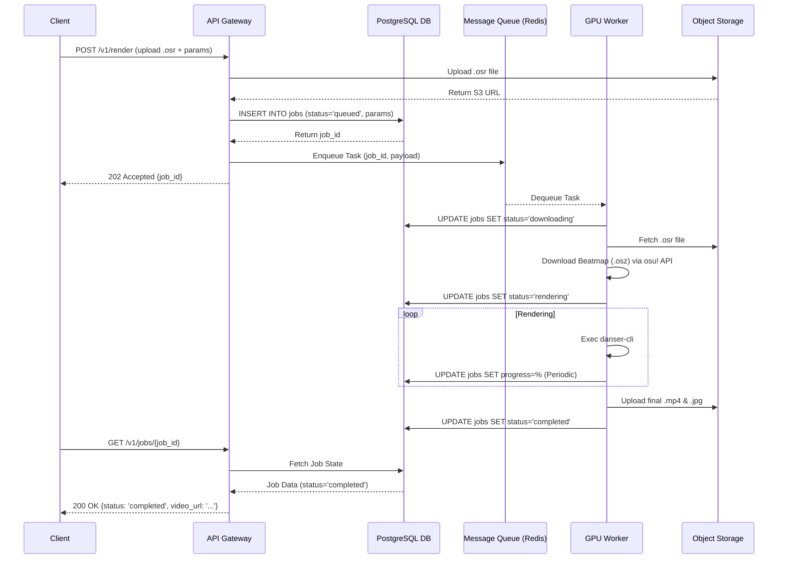

# OsuRender API - Implementation & Use Case Document

## 1. Overview
This document outlines the primary use cases, data models, and interaction flows for the newly architected OsuRender API. By defining clear contracts and boundaries, we ensure that frontend consumers and backend workers can interact seamlessly.

## 2. Core Use Cases

| ID | Use Case | Description | Primary Actor |
|---|---|---|---|
| UC-1 | Submit Replay | User uploads a `.osr` file with rendering parameters. The system returns a tracking `job_id`. | Client |
| UC-2 | Check Job Status | User polls the API with their `job_id` to get rendering progress, status, and logs. | Client |
| UC-3 | Download Render | User downloads the finished `.mp4` video and thumbnail from Object Storage. | Client |
| UC-4 | Upload Skin | User uploads a `.osk` file, making a new skin available globally for rendering. | Admin/Client |
| UC-5 | Process Render (Internal) | GPU Worker picks up a queued job, resolves assets, runs `danser-go`, and uploads artifacts. | System Worker |

## 3. Sequence Diagrams

### 3.1 Job Submission & Rendering Flow
This diagram illustrates the separation of concerns between the API, Queue, and Worker.



## 4. API Contract Specifications (REST v1)

All endpoints follow RESTful standards and return JSON. 

### 4.1 `POST /v1/render`
**Content-Type**: `multipart/form-data`
- `replay` (file): The `.osr` file.
- `skin` (string, optional): Selected skin name (default: "Default").
- `bg_dim` (float, optional): Background dim percentage `0.0 - 1.0`.
- `resolution` (string, optional): `1080p` or `4k`.

**Response** (202 Accepted):
```json
{
  "job_id": "uuid-v4-string",
  "status": "queued",
  "links": {
    "status": "/v1/jobs/uuid-v4-string"
  }
}
```

### 4.2 `GET /v1/jobs/{job_id}`
**Response** (200 OK):
```json
{
  "job_id": "uuid-v4-string",
  "status": "rendering",
  "progress": 45.5,
  "map_title": "Omoi - Teo [Expert]",
  "created_at": "2026-06-08T10:00:00Z",
  "error_message": null,
  "artifacts": {
    "video_url": null,
    "thumbnail_url": null
  }
}
```

## 5. Database Schema (PostgreSQL)

To maintain state robustly, the following schema is proposed:

```sql
CREATE TYPE job_status AS ENUM (
    'queued', 'downloading', 'rendering', 'completed', 'failed'
);

CREATE TABLE jobs (
    id UUID PRIMARY KEY DEFAULT gen_random_uuid(),
    status job_status NOT NULL DEFAULT 'queued',
    progress FLOAT DEFAULT 0.0,
    
    -- Inputs
    replay_s3_key VARCHAR(255) NOT NULL,
    config JSONB NOT NULL DEFAULT '{}',
    
    -- Metadata extracted during processing
    beatmap_id INT,
    map_title VARCHAR(255),
    
    -- Outputs
    video_s3_key VARCHAR(255),
    thumb_s3_key VARCHAR(255),
    error_message TEXT,
    
    created_at TIMESTAMP WITH TIME ZONE DEFAULT CURRENT_TIMESTAMP,
    updated_at TIMESTAMP WITH TIME ZONE DEFAULT CURRENT_TIMESTAMP
);

-- Indices for performance
CREATE INDEX idx_jobs_status ON jobs(status);
CREATE INDEX idx_jobs_created_at ON jobs(created_at);
```

## 6. Implementation Milestones
1. **Phase 1: Foundation**: Set up FastAPI structure, PostgreSQL schema, and Redis container locally using Docker Compose.
2. **Phase 2: Storage Abstraction**: Integrate S3/MinIO to completely remove local file system dependencies for assets.
3. **Phase 3: Worker Decoupling**: Implement Celery/RQ workers that listen to the Redis queue and perform the actual `danser-go` execution.
4. **Phase 4: Cloud Deployment**: Deploy the API layer to a container runtime (e.g., AWS ECS, Kubernetes) and the GPU Workers to a dedicated GPU platform like Modal.
