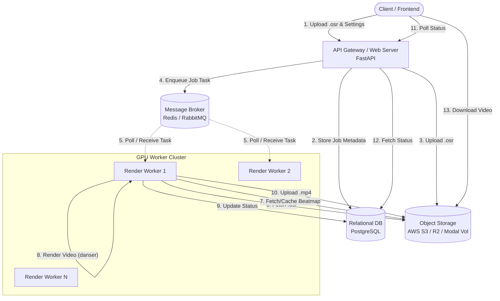

# OsuRender API - System Architecture Document

## 1. Overview
The proposed architecture transitions the OsuRender API from a monolithic, single-node application into a decoupled, scalable, and resilient distributed system. By separating the API layer from the compute-heavy rendering layer, we can scale them independently and ensure stability under heavy load.

## 2. High-Level Architecture Diagram

## 3. Core Components

### 3.1 API Gateway (FastAPI)
- **Role**: Entry point for all client interactions. Fully stateless.
- **Responsibilities**: 
  - Authenticate and rate-limit requests.
  - Validate and sanitize incoming payload (`.osr` files and configurations).
  - Create job entries in the database.
  - Upload raw assets (skins, replays) to Object Storage.
  - Push tasks onto the Message Queue.
- **Tech Stack**: Python, FastAPI, Uvicorn/Gunicorn.

### 3.2 Message Broker (Redis / RabbitMQ)
- **Role**: Asynchronous task queue decoupling the API from the heavy lifting.
- **Responsibilities**:
  - Buffer incoming render requests during traffic spikes.
  - Distribute tasks reliably to available GPU workers (e.g., using Celery or RQ).
  - Handle task retries for transient failures.

### 3.3 GPU Render Workers (Modal / Kubernetes)
- **Role**: Compute nodes equipped with GPUs (NVIDIA T4/A10G) responsible for running `danser-go`.
- **Responsibilities**:
  - Fetch job payloads and associated assets from Object Storage.
  - Resolve and download missing beatmaps from osu! APIs securely.
  - Execute headless video rendering via `xvfb-run` and `danser-cli`.
  - Process video thumbnails via `ffmpeg`.
  - Upload final assets (`.mp4`, `.jpg`, `.log`) back to Object Storage.
  - Continually ping the Database with heartbeat and progress updates.

### 3.4 Persistent Database (PostgreSQL)
- **Role**: Source of truth for system state.
- **Schema Focus**: 
  - `jobs` (id, status, progress, config, error_message, created_at)
  - `users` (id, api_keys, tier)
  - `beatmaps` (hash, map_id, downloaded_status)

### 3.5 Object Storage (S3 / Cloudflare R2)
- **Role**: Binary storage layer.
- **Stored Data**: Replays (`.osr`), Skins (`.osk`), Beatmaps (`.osz`), Videos (`.mp4`), and Logs (`.log`).

## 4. Scalability & Reliability Patterns
- **Worker Auto-Scaling**: The number of GPU workers scales dynamically based on the queue depth in Redis. Services like Modal natively support serverless scaling, spinning up containers only when tasks are present.
- **Stateless Web Nodes**: We can place the API behind a Load Balancer (e.g., NGINX or AWS ALB) and run multiple replicas.
- **Idempotent Workers**: If a worker crashes mid-render, the unacknowledged task is returned to the queue and picked up by a healthy worker. Storage uploads use unique job IDs to prevent race conditions.

## 5. Security Posture
- **Payload Validation**: Strict MIME-type checking and file size limits before processing `.osr` and `.osk` files.
- **Network Isolation**: GPU Workers are strictly isolated, only permitted outbound access to the osu! API and the internal Database/Storage. They do not expose open ports to the internet.
- **Least Privilege**: The process executing `danser-go` runs as a non-root user.
